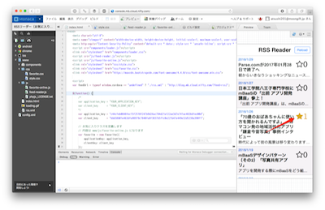

# 5. RSSリーダー（お気に入り登録機能付き）を開発する（その2）

このステップでは先ほど登録したお気に入りのデータを取得して、画面に反映するところまで行います。処理としては、 `Favorite.prototype.apply` の開発になります。

## js/favorite-online.jsの修正（41行目付近）

元々のコードは次のようになっています。ここで送られてくるitemという変数は記事一覧の一つ一つのデータになります。

```
// 一つの記事に対してお気に入り状態を反映させる
Favorite.prototype.apply = function(item) {
    
};
```

処理の内容としては次のようになります。

1. 変数の定義
1. お気に入り登録数を検索
1. 自分がお気に入り登録済みか調べる
  1. 登録済みであれば星マークを黄色に
  1. 未登録の場合は星マークを黒に

```
// 一つの記事に対してお気に入り状態を反映させる
Favorite.prototype.apply = function(item) {
    // 変数の定義
    // お気に入り登録数を検索
    // 自分がお気に入り登録済みか調べる
        // 登録済みであれば星マークを黄色に
        // 未登録の場合は星マークを黒に
};
```

### 変数の定義

扱う変数は3つです。

- 自分自身（this）
- URL
- アイコン

URL、アイコンはitemから取得できます。

```
var self = this;
var url = item.data('link');
var icon = item.children('i');
```

### お気に入り登録数を検索

お気に入り登録数はURLを使ってfavoriteクラスを検索します。この時、`count()`を使うことでデータ件数だけを取得できます。

```
this.FavoriteClass.equalTo("url", url)
.count()
```

そして、 `fetchAll()` メソッドで検索処理を実行します。

```
this.FavoriteClass.equalTo("url", url)
  .count()
  .fetchAll()
```

検索処理がうまくいった場合は `then()` メソッドに、失敗した場合は `catch()` メソッドが呼ばれます。

```
this.FavoriteClass.equalTo("url", url)
  .count()
  .fetchAll()
  .then(function(results){
    // 検索がうまくいった場合
  })
  .catch(function(error){
    // 検索が失敗した場合
  });
```

検索がうまくいった場合、`results.count` で検索にマッチするデータの件数が取得できますので、これを星マークの横に表示します。失敗した場合は強制的に0を表示します。

結果として登録数の検索は次のようになります。

```
// お気に入り登録数を検索
this.FavoriteClass.equalTo("url", url)
    .count()
    .fetchAll()
    .then(function(results){
      if (results.count > 0) {
        icon.text(results.count);
      } else {
        icon.text("0");
      }
    })
    .catch(function(error){
      console.log(error.message);
      icon.text("0");
    });
```

### 自分がお気に入り登録済みか調べる

次に自分がそのURLを登録済みかどうかチェックします。これは先ほどの条件に加えて、UUIDも条件に追加します。

```
this.FavoriteClass
    .equalTo("uuid", self.uuid)
    .equalTo("url", url)
    .count()
```

そして `fetchAll()` メソッドを実行し、返ってきた結果が 0 であれば未登録、0以上であれば登録済みと判定します。今回はエラーの場合はメッセージだけ出すのみとしています。

```
.fetchAll()
.then(function(results){
    if (results.count > 0) {
        // 登録済みであれば星マークを黄色に
        icon.addClass('fa-star');
        icon.removeClass('fa-star-o');
    } else {
        // 未登録の場合は星マークを黒に
        icon.removeClass('fa-star');
        icon.addClass('fa-star-o');
    }
})
.catch(function(error){
    console.log('own favorite check error: ' + error.message);
});
```

自分がお気に入り登録しているかどうかの判定処理は次のようになります。

```
// 自分がお気に入り登録済みか調べる
this.FavoriteClass
    .equalTo("uuid", self.uuid)
    .equalTo("url", url)
    .count()
    .fetchAll()
    .then(function(results){
        if (results.count > 0) {
            // 登録済みであれば星マークを黄色に
            icon.addClass('fa-star');
            icon.removeClass('fa-star-o');
        } else {
            // 未登録の場合は星マークを黒に
            icon.removeClass('fa-star');
            icon.addClass('fa-star-o');
        }
    })
    .catch(function(error){
        console.log('own favorite check error: ' + error.message);
    });
```

## 表示を確認する

`apply()` メソッド全体は次のようになります。

```
// 一つの記事に対してお気に入り状態を反映させる
Favorite.prototype.apply = function(item) {
    // 変数の定義
    var self = this;
    var url = item.data('link');
    var icon = item.children('i');
    
    // お気に入り登録数を検索
    this.FavoriteClass.equalTo("url", url)
        .count()
        .fetchAll()
        .then(function(results){
            if (results.count > 0) {
                icon.text(results.count);
            } else {
                icon.text("0");
            }
        })
        .catch(function(error){
            console.log(error.message);
            icon.text("0");
        });

    // 自分がお気に入り登録済みか調べる
    this.FavoriteClass
        .equalTo("uuid", self.uuid)
        .equalTo("url", url)
        .count()
        .fetchAll()
        .then(function(results){
            if (results.count > 0) {
                // 登録済みであれば星マークを黄色に
                icon.addClass('fa-star');
                icon.removeClass('fa-star-o');
            } else {
                // 未登録の場合は星マークを黒に
                icon.removeClass('fa-star');
                icon.addClass('fa-star-o');
            }
        })
        .catch(function(error){
            console.log('own favorite check error: ' + error.message);
        });
};
```

うまくできていれば、プレビューにて次のように表示されるはずです。先ほどお気に入り登録した記事だけ星マークが黄色くなって、数字が1になっていればOKです。



また、別な記事の星をクリックすると、その場で星マークが黄色に変わるのが確認できるはずです。

----

今回まででお気に入り登録ができ、表示に反映されるところまでできあがりました。[次は最後のステップとして、お気に入り登録したデータを削除する処理](./6.md)を作っていきます。

なお、ここまでのコードは[CW_Monaca_NCMB_Handson/5-project at master · NIFTYCloud-mbaas/CW_Monaca_NCMB_Handson](https://github.com/NIFTYCloud-mbaas/CW_Monaca_NCMB_Handson/tree/master/5-project)にアップしてあります。うまく動かない場合は参考にしてください。
